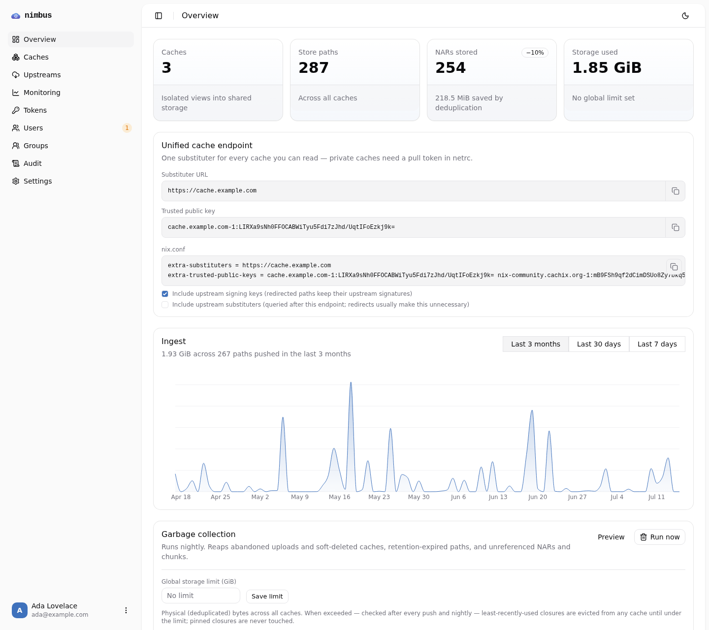
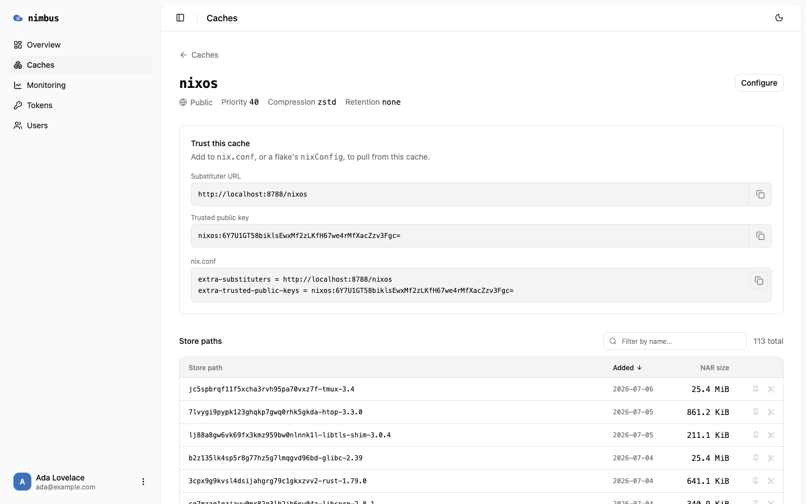
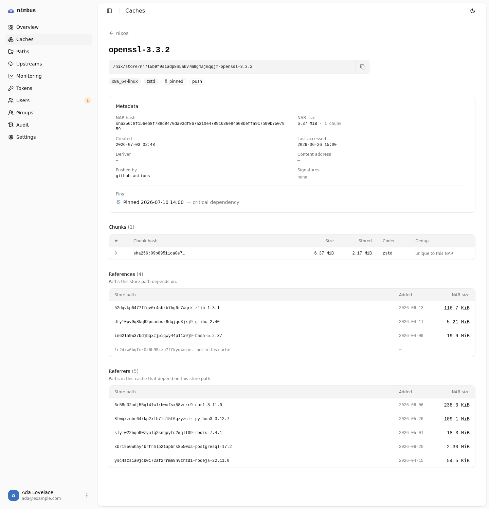
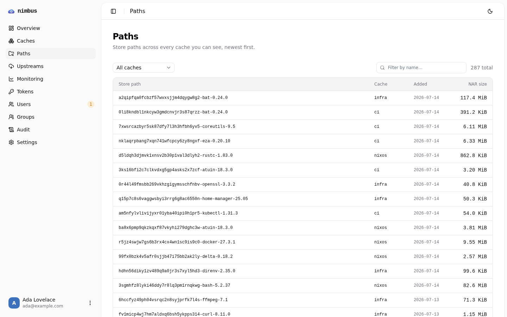
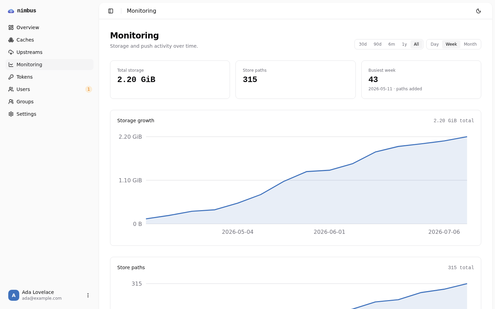
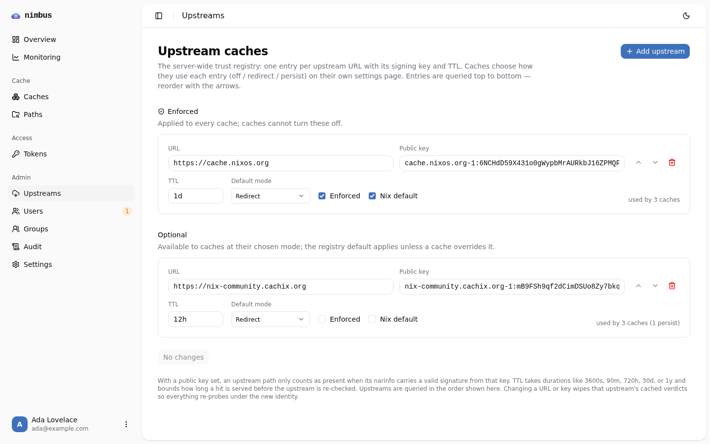

# nimbus

Nimbus is a serverless, self-hostable Nix binary cache. A Cloudflare Worker (backed by
D1 and R2) serves an [attic](https://github.com/zhaofengli/attic)-compatible
cache with deduplicated storage, closure-aware garbage collection, and a web
dashboard — no servers to run, no idle cost.

```bash
# install the CLI
nix profile install github:kclejeune/nimbus   # or: go install github.com/kclejeune/nimbus/cmd/nimbus@latest

# point it at a nimbus deployment
nimbus login prod https://cache.example.com   # browser locally, device code over SSH

# create a cache, push closures, pull from it
nimbus cache create mycache --public
nimbus push mycache ./result
nimbus use mycache                            # wires up nix.conf (+ netrc if private)
```

Deploying the server is one Worker: `cd web && npm run deploy` — see
[Deploy](#deploy). The [CLI](#cli) section covers the full command set.



## Motivation

Running a Nix cache shouldn't require running a machine. The excellent
self-hosted options all assume a long-lived server plus a relational database
plus object storage — three things to provision, patch, and pay for while they
sit idle between CI runs. nimbus reimplements the same protocol on
pay-per-request primitives: a Worker for compute, D1 (SQLite) for metadata,
and R2 for NAR/chunk storage (with zero egress fees, which matters for a
binary cache). The storage and database surfaces are deliberately thin — a
portable SQLite schema and a flat object layout — so other serverless
platforms are within reach, but Cloudflare is the deployment target today.

## Standing on attic's shoulders

nimbus is unapologetically an [attic](https://github.com/zhaofengli/attic)
reimplementation, and it exists because attic got the design right: caches as
isolated views into one deduplicated content-addressed store, content-defined
chunking for dedup that survives small rebuilds, JWT-scoped per-cache
permissions, and an HTTP protocol clean enough that a third party can
reimplement it from the source. All of that architecture is attic's, and it
deserves the credit. nimbus speaks the attic protocol on the wire — stock
attic clients work against a nimbus server — and swaps the implementation
underneath for one that fits inside a Worker's constraints.

## Features

- **Attic-compatible protocol** — the full binary-cache surface (narinfo/NAR
  serving with managed Ed25519 signing, `nix-cache-info`, ranges) plus the
  `/_api/v1` API (get-missing-paths, upload-path, cache-config), extended with
  nimbus endpoints for cache rename, pins/GC roots, server GC, and chunked
  uploads. Existing attic clients work unmodified for everything but > 100 MB
  pushes (the Workers request-body limit), which need the nimbus CLI.
- **Multi-tenant caches, global dedup** — public or private caches share one
  content-addressed store; NARs dedup whole and by FastCDC content-defined
  chunks that dedup individually across caches. Uploads ≥ 8 MiB are chunked
  server-side; > 100 MB NARs are cut client-side by the nimbus CLI with
  boundary-identical FastCDC, so only chunks the server lacks are uploaded.
- **Fine-grained access control** — per-user and per-group permission grants
  using attic's bit vocabulary over cache-name patterns (`ci-*`), managed from
  the dashboard (per subject or per cache), with OIDC group-claim sync into
  local groups. Cache creators automatically get full control of what they
  create, grants follow renames, and token minting is bounded by the issuer's
  own effective permissions. New accounts start pending until an admin — or a
  configured OIDC group (`OIDC_ACTIVATION_GROUP`) — activates them.
- **Unified cache endpoint** — the cache-host root doubles as a substituter
  for everything the requester may read: `/<hash>.narinfo` and `/nar/<file>`
  resolve across all public caches (plus private ones the bearer token can
  pull) in priority order, re-signed with a single proxy key. One
  `substituters` line and one `trusted-public-keys` entry cover every cache.
- **Server-side compression** — per-cache zstd (WASM), gzip, or none;
  brotli/xz NARs from older imports remain readable.
- **Upstream registry** — upstream trust (URL + public key + TTL) lives in a
  server-wide, admin-managed registry (one row per URL, so key conflicts are
  unrepresentable); caches subscribe per-entry as off/redirect/persist,
  enforced entries apply to every cache, and entries already in Nix's default
  config can be flagged so generated snippets omit them. `get-missing-paths`
  filters against enabled upstreams with cached verdicts so already-public
  paths are never pushed, narinfo reads pass through, NAR reads redirect to
  the upstream, and persist-mode entries are ingested (re-signed) into the
  cache in the background. Every trust card ships a copyable `nix.conf`
  snippet with toggles for including upstream keys and substituters.
- **Closure-aware GC** — retention keeps _full closures_ of fresh objects and
  pinned roots (never a broken closure), with per-cache size budgets, a global
  storage ceiling, size-triggered eviction after pushes, abandoned-upload
  reaping, and a nightly cron. Path removal is closure-safe: a removed path's
  shared dependencies stay until their last dependent goes. Pins come in two
  flavors — quick single-path pins, and cachix-style **named pins** with
  revision history (`--keep-revisions` / `--keep-days`).
- **Admin UI** — cache management with per-cache access lists and size-budget
  meters, store-path browsing/search with per-path detail (references,
  referrers, NAR/chunk breakdown) plus a cross-cache path explorer over
  everything the viewer can read, pin/prune, scoped token issuance with
  revocation, users/groups/grants, user activation, upstream registry
  management, ingest monitoring (plus read-traffic hit/miss stats via
  Analytics Engine when configured), GC run reports with closure-integrity
  warnings, and an audit log of privileged actions.
- **Flexible auth** — OIDC or Cloudflare Access for the dashboard (with OIDC
  group sync and pending-user approval); HS256/RS256 attic JWTs for the
  protocol; browser-loopback and RFC 8628 device-code flows for CLI login.
- **Built for the edge** — narinfo/NAR reads are edge-cached (tag-purged by
  GC), hot paths read from D1 replica sessions instead of the write primary,
  and speculative reference prefetch warms the edge cache behind strict
  rate-limit guardrails.
- **Go CLI** — `login`, `use`, `push` (parallel, closure-aware, `--stdin`),
  `watch-store`, `watch-exec` (batched with idle flushing), `gc`, `whoami`,
  headless token management (`token create|list|revoke`), and full cache
  administration (`list`, `create`, `configure`, `rename`, `pin(s)`, `rm`,
  `destroy`).

<table>
  <tr>
    <td></td>
    <td></td>
  </tr>
  <tr>
    <td></td>
    <td></td>
  </tr>
  <tr>
    <td colspan="2"></td>
  </tr>
</table>

## Comparison with attic

|                    | attic                                          | nimbus                                                                                                            |
| ------------------ | ---------------------------------------------- | ----------------------------------------------------------------------------------------------------------------- |
| Runtime            | Rust daemon (`atticd`) on a server you operate | Cloudflare Worker, scales to zero                                                                                 |
| Database           | PostgreSQL or SQLite                           | D1 (SQLite; schema is portable)                                                                                   |
| Storage            | S3-compatible or local disk                    | R2 (zero-egress)                                                                                                  |
| Deduplication      | whole-NAR + FastCDC chunks (16/64/256 KiB)     | whole-NAR + FastCDC chunks (2/8/16 MiB); > 100 MB NARs chunked client-side with identical boundaries              |
| Compression        | server-wide zstd/brotli/xz                     | per-cache zstd/gzip/none                                                                                          |
| Garbage collection | per-object LRU (can orphan closure members)    | closure-aware retention, pins, per-cache budgets, global ceiling                                                  |
| Upstream caches    | client-side skip via signing-key names         | server-side registry: redirect/persist pull-through, enforced entries, cached verdicts, generated nix.conf        |
| Tokens             | static JWTs via `atticadm make-token`          | dashboard-issued, scoped, revocable (`jti` + hashed storage), bounded by the issuer's grants                      |
| Access control     | per-token JWT permission bits                  | user/group grants (same bit vocabulary) + OIDC group sync, enforced in the UI and API; per-token bits on the wire |
| Substituter config | one URL + key per cache                        | per-cache, or one unified endpoint + proxy key for all readable caches                                            |
| CLI auth           | paste a token                                  | browser loopback, device code, or paste a token                                                                   |
| Admin interface    | CLI only                                       | web dashboard + CLI                                                                                               |
| NAR downloads      | can 307 to presigned S3 URLs                   | local NARs proxied through the Worker; upstream paths 302 to the upstream                                         |

### Gaps and differences

Honest accounting of where nimbus trails or diverges from the reference:

- **> 100 MB pushes need the nimbus CLI.** The Workers request-body limit
  rules out attic's single-PUT upload for large NARs; nimbus replaces it with
  a chunked protocol (client-side FastCDC + zstd, dedup per chunk) that stock
  attic clients don't speak.
- **Chunk boundaries are self-consistent, not attic's.** nimbus uses larger
  FastCDC parameters (every chunk is an R2 subrequest), so a store migrated
  from attic won't share chunk identities with it. The CLI's client-side
  cutter is bit-identical to the server's, so client- and server-chunked NARs
  do dedup against each other.
- **RS256 is verify-only** — the dashboard mints HS256 tokens; attic can also
  sign RS256.
- **No presigned-URL downloads** — locally-stored NAR bytes always proxy
  through the Worker (upstream-cached paths do redirect); R2's zero egress
  makes this cheaper than it would be on S3.
- **Token minting needs a bootstrap identity** — `nimbus token create` mints
  scoped tokens headlessly, but it acts as the user behind a dashboard- or
  CLI-login-issued token; there is no config-file-secret path to mint from
  nothing like `atticadm make-token`.
- **`retention_period` is expressed in days** (`null` = unlimited) rather
  than attic's seconds with a global default.

## CLI

```bash
nimbus login prod https://cache.example.com <token>    # non-interactive: paste a token
nimbus login prod https://cache.example.com --device   # force device-code flow (--web forces browser)
nimbus cache create mycache --public --compression zstd --priority 40
nimbus cache configure mycache --retention-days 30 --retention-max-bytes 50000000000
nimbus use mycache                                     # wire up nix.conf (+ netrc if private)
nimbus push mycache ./result /nix/store/...            # closures, parallel, chunked >100MB
nimbus push mycache --stdin < paths.txt                # read paths from stdin
nimbus push mycache --no-closure --jobs 10 ...         # exact paths, more parallelism
nimbus watch-store mycache                             # push new store paths as they appear
nimbus watch-exec mycache -- nix build ...             # watch during a command, flush on exit
nimbus watch-exec mycache --batch-idle 30s -- ...      # also flush during long build stalls
nimbus gc --dry-run                                    # trigger/preview garbage collection
nimbus whoami                                          # inspect the configured token (scopes, expiry)
nimbus cache list                                      # caches you can see, with your access bits
nimbus cache info|configure|rename|pin|unpin|destroy mycache
nimbus cache pin mycache v1.7 /nix/store/... --keep-revisions 5   # named pin with history
nimbus cache pins mycache                              # list pins and their revisions
nimbus cache unpin mycache v1.7                        # drop the pin and all its revisions
nimbus cache rm mycache /nix/store/...                 # closure-safe path removal
nimbus use mycache --remove                            # unwind nix.conf/netrc edits
nimbus token create ci --cache 'ci-*' --pull --push --expiry-days 90   # headless scoped tokens
nimbus token list|revoke                               # inspect and revoke issued tokens
```

Caches are addressed as `[server:]cache`; the first login becomes the default
server (`--set-default` overrides later). Config lives at
`~/.config/nimbus/config.toml` (XDG respected) — a server's token can live in
a separate file via `token_file` — and CI can skip config entirely with
`NIMBUS_ENDPOINT` + `NIMBUS_AUTH_TOKEN` (or `NIMBUS_AUTH_TOKEN_FILE`).

Pushes query the closure via `nix path-info`, skip paths the server already
has (or can fetch from its upstreams — `--ignore-upstream-cache-filter`
overrides), and upload raw NARs for the server to compress — except >100MB
NARs, which are cut with the same FastCDC boundaries as the server,
zstd-compressed client-side, and uploaded chunk-by-chunk (only the chunks the
server is missing). `watch-exec` batches everything into one closure-deduped
push on exit by default, flushing early whenever the store goes idle for
`--batch-idle` (15s default); `--batch=false` streams paths as they settle.

## Layout

```
cmd/nimbus/  Go CLI client (cobra + fang)
internal/    CLI internals: config, API client, nix interop, push engine, FastCDC chunker
web/         SvelteKit app: the admin UI and the binary-cache API server (one Worker)
```

The Worker serves two hostnames from one deployment: the admin UI on its app
domain and the Nix binary-cache API on the cache domain, dispatched by host in
`web/worker-entry.ts`.

## Development

CLI:

```bash
mise run check    # lint + test + build (binary at build/nimbus)
```

Web:

```bash
cd web
npm install
npm run check                            # svelte-check
npm test                                 # vitest (pure server logic)
npm run build                            # vite build + Cloudflare adapter
npx wrangler dev --host localhost:8788   # --host defeats the custom-domain Host rewrite
```

Local secrets live in `web/.dev.vars` (gitignored). The attic-table schema and
its migrations are in `web/schema/` (wired to `wrangler d1 migrations`); the
admin-table (users, groups, grants, tokens) migrations are drizzle-generated
in `web/drizzle/`. For a local database, apply `schema/schema.sql` and the
drizzle files with `wrangler d1 execute attic --local --file=...`.

## Deploy

[](https://deploy.workers.cloudflare.com/?url=https://github.com/kclejeune/nimbus/tree/main/web)

One-click: the button clones this repo into your GitHub/GitLab account,
provisions the D1 database and R2 bucket in your Cloudflare account, prompts
for secrets, and deploys to a `workers.dev` hostname. Finish by adding your
two custom domains — see [docs/deploy.md](docs/deploy.md#one-click-deploy).

Manual:

```bash
cd web && npm run deploy   # applies pending D1 migrations, builds, deploys
```

See **[docs/deploy.md](docs/deploy.md)** for the full self-hosting
walkthrough: creating the D1/R2 resources, hostnames, authentication options,
secrets, and optional monitoring/WAF hardening. `web/wrangler.jsonc` is the
deployment manifest — edit it in your fork, or keep your values in an
untracked `web/wrangler.local.jsonc` (picked up automatically) so pulls stay
conflict-free. Custom domains and the nightly GC cron are declared there;
domains not listed are detached on deploy, so keep that file the source of
truth.
