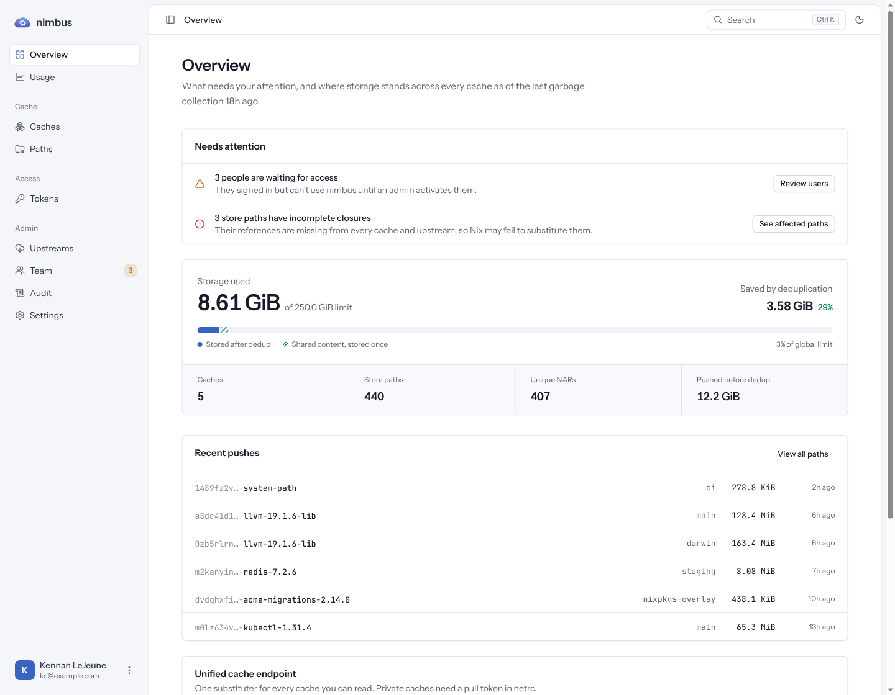
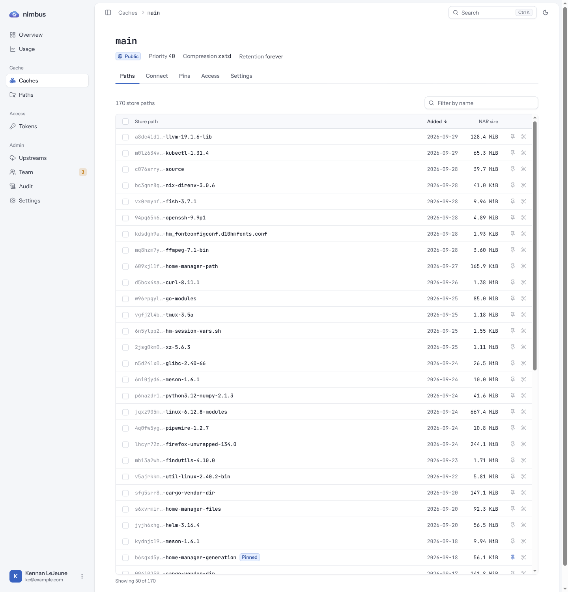
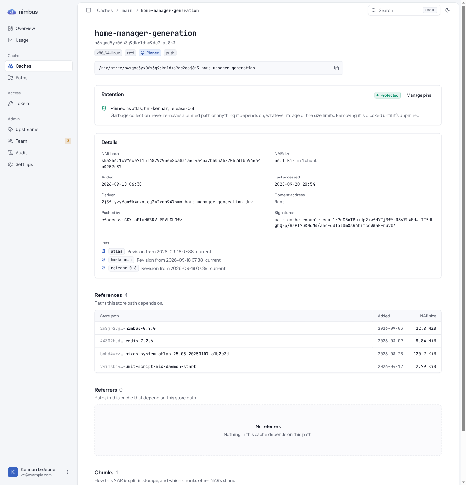
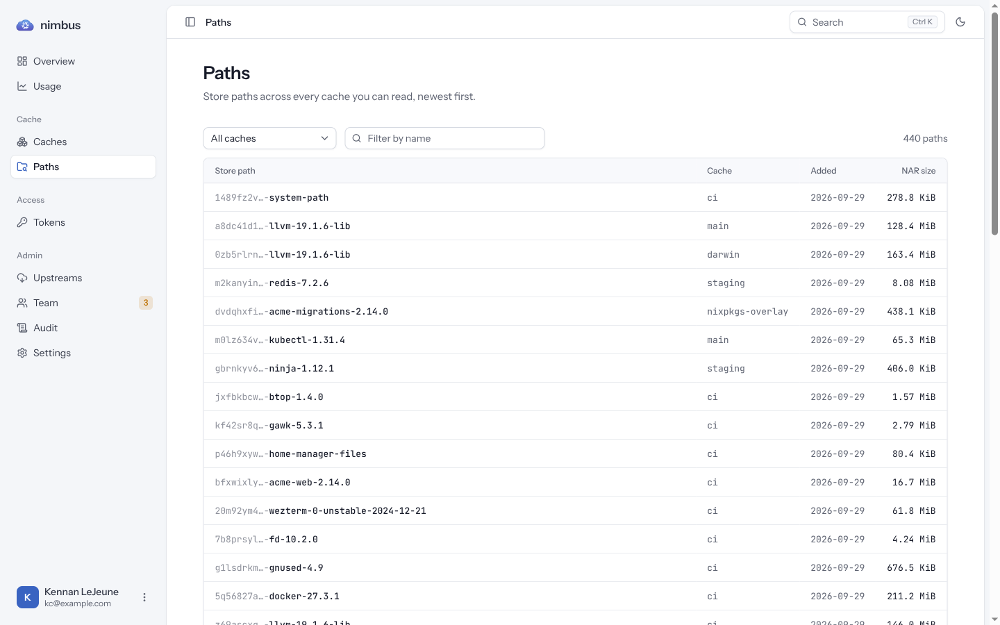
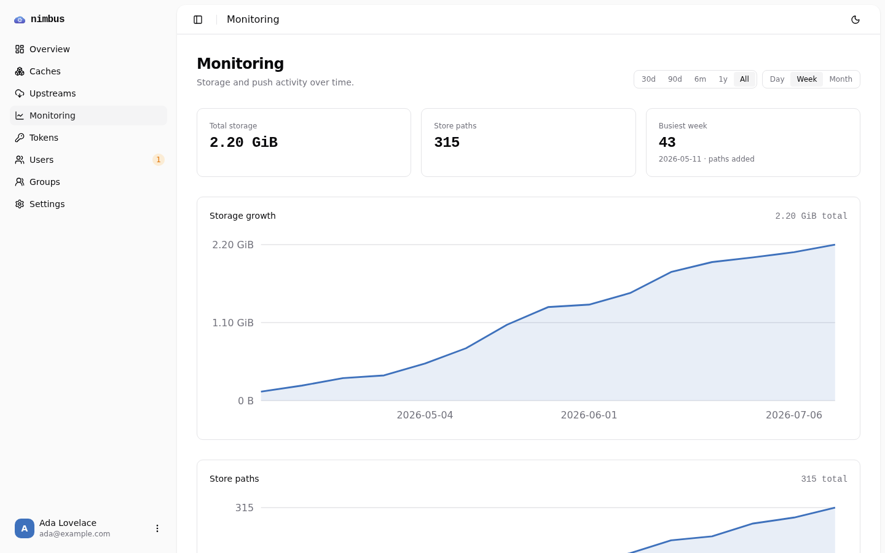
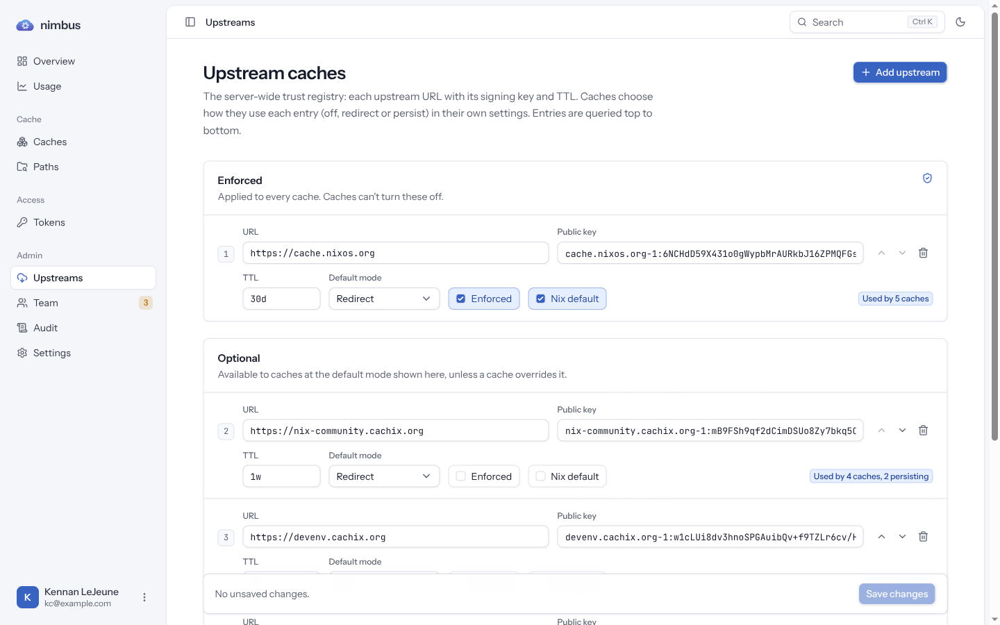

# nimbus

nimbus is a serverless, self-hostable Nix binary cache. A Cloudflare Worker
backed by D1 and R2 serves a cache built on
[attic](https://github.com/zhaofengli/attic)'s protocol, with deduplicated
storage, closure-aware garbage collection, and a web dashboard. There is no
server to run and no idle cost.

> **Partial attic compatibility.** Nix substitution, attic tokens, and the
> stock client's push/pull path work; `attic cache configure` and a few other
> operations do not. See [attic compatibility](#attic-compatibility).

```bash
# install the CLI
nix profile install github:kclejeune/nimbus   # or: go install github.com/kclejeune/nimbus/cmd/nimbus@latest

# point it at a nimbus deployment
nimbus login prod https://cache.example.com   # browser locally, device code over SSH

# create a cache, push closures, pull from it
nimbus cache create mycache --public
nimbus push mycache ./result
nimbus use mycache                            # wires up nix.conf (+ netrc if private)
```

The server is a single Worker, deployed with `cd web && npm run deploy` (see
[Deploy](#deploy)). [CLI](#cli) covers the full command set.



## Motivation

Running a Nix cache shouldn't require running a machine. The established
self-hosted options assume a long-lived server, a relational database, and
object storage, all provisioned, patched, and paid for while they sit idle
between CI runs. nimbus implements the same protocol on pay-per-request
primitives: a Worker for compute, D1 (SQLite) for metadata, and R2 for NAR and
chunk storage. R2 has no egress fees, which matters for a binary cache. The
storage and database layers are thin (a portable SQLite schema and a flat
object layout), but Cloudflare is the only supported target today.

## Features

- **Attic-compatible protocol.** The binary-cache surface (`nix-cache-info`,
  narinfo, NARs, server-managed Ed25519 signing) and the `/_api/v1` API
  (get-missing-paths, upload-path, cache-config), extended with endpoints for
  cache rename, pins, path removal, server GC, and chunked uploads.
- **Multi-tenant caches, global dedup.** Public and private caches share one
  content-addressed store. NARs dedup whole, and NARs of 8 MiB or more are cut
  into FastCDC chunks that dedup individually across caches. The nimbus CLI
  chunks large NARs itself and uploads only the chunks the server lacks.
- **Access control.** Per-user and per-group grants in attic's permission-bit
  vocabulary over cache names or globs (`ci-*`), managed per subject or per
  cache. OIDC group claims sync into local groups. Cache creators get full
  control of what they create, grants follow renames, and a token can never
  exceed its issuer's effective grants. New accounts wait for an admin, or
  for membership in `OIDC_ACTIVATION_GROUP`.
- **Unified cache endpoint.** The cache host's root is a substituter over
  every cache the requester can read: public caches plus private ones the
  bearer token can pull, in priority order, re-signed with one proxy key. One
  `substituters` entry and one `trusted-public-keys` entry cover them all.
- **Server-side compression.** Per-cache zstd (WASM), gzip, or none; brotli
  and xz NARs from older imports stay readable.
- **Upstream registry.** Admins manage trusted upstreams (URL, public key,
  TTL) in one registry. Each cache subscribes to each upstream as off,
  redirect, or persist, and enforced upstreams apply to every cache.
  `get-missing-paths` filters out paths an upstream already serves (with
  cached verdicts), so they are never pushed. Reads of those paths pass the
  narinfo through and redirect NARs to the upstream; persist mode also
  ingests and re-signs them in the background. Every cache and upstream
  offers a generated `nix.conf` snippet.
- **Closure-aware GC.** Retention keeps the full closures of recently used
  paths and pins, so GC never leaves a broken closure. Per-cache age and size
  budgets, a global storage ceiling, eviction after pushes that exceed a
  budget, abandoned-upload reaping, and a nightly run. Removing a path keeps
  its dependencies while other paths still need them. Pins are either single
  paths or cachix-style named pins with revision history
  (`--keep-revisions`, `--keep-days`).
- **Admin UI.** Caches with access lists and budget meters; store-path
  browsing and search with references, referrers, and NAR/chunk breakdowns;
  a cross-cache path explorer; pins; scoped token issuance and revocation;
  users, groups, and grants; the upstream registry; ingest and (with Analytics
  Engine) read-traffic monitoring; GC reports with closure-integrity
  warnings; and an audit log.
- **Auth.** OIDC or Cloudflare Access for the dashboard; HS256 attic JWTs
  (plus RS256 verification) for the protocol.
- **Edge-cached reads.** narinfo and NAR responses are edge-cached and purged
  by cache tag, and cache misses read from D1 replicas rather than the write
  primary.
- **Go CLI.** Browser-loopback and RFC 8628 device-code login, closure-aware
  parallel `push`, store watching, server GC, and cache and token
  administration. See [CLI](#cli).

<table>
  <tr>
    <td></td>
    <td></td>
  </tr>
  <tr>
    <td></td>
    <td></td>
  </tr>
  <tr>
    <td colspan="2"></td>
  </tr>
</table>

## nimbus and attic

nimbus reimplements [attic](https://github.com/zhaofengli/attic), and the
design is attic's: caches as isolated views into one deduplicated
content-addressed store, content-defined chunking so dedup survives small
rebuilds, JWT-scoped per-cache permissions, and an HTTP protocol clean enough
to reimplement from the source. nimbus keeps attic's wire protocol and token
format and replaces the implementation underneath with one that fits a
Worker's constraints.

### attic compatibility

Verified with the stock client built from attic
[`7a19204`](https://github.com/zhaofengli/attic/commit/7a19204) against a local
nimbus Worker, plus a source comparison of both sides.

**Works:**

- Nix substitution from public and private caches (netrc Basic auth), with
  nimbus-signed narinfos.
- attic-minted tokens: HS256, or RS256 given the public key, including
  `iss`/`aud` binding and cache-name globs.
- `attic login`, `use`, `cache create`, `cache info`, `cache destroy`, and
  `push` / `watch-store` of closures, deduplicated against what the cache
  already holds.

**Broken:**

- `attic cache configure` always fails: the client sends retention as attic's
  `{"Period": seconds}` / `"Global"` enum, which nimbus rejects (nimbus stores
  retention as an integer number of days).
- Once a cache has a retention period (set from the dashboard or nimbus
  CLI), the stock client cannot decode its config, so `attic push`, `use`,
  `cache info`, and `watch-store` fail for that cache.
- NARs of 100 MiB or more exceed the Workers request-body limit; nimbus
  replaces attic's single-PUT upload with a chunked protocol only the nimbus
  CLI speaks.
- A push whose closure has more than 10,000 paths fails: attic sends them in
  one `get-missing-paths` request, which nimbus caps at 10,000.
- Cache names are limited to lowercase letters, digits, and `-`; attic also
  allows uppercase, `_`, and `+`.

**Differs:**

- `upstream_cache_key_names` from `attic cache create` is discarded, so the
  client's signature-based upstream skip is off; nimbus filters upstream
  paths server-side through its upstream registry instead.
- Changing visibility, keys, or upstream key names needs a nimbus-only token
  claim, so attic-minted tokens cannot make those changes.
- Upload admission can return `503` with `Retry-After` under load; the stock
  client does not retry.

### Comparison with attic

As of attic [`7a19204`](https://github.com/zhaofengli/attic/commit/7a19204) (July 2026).

|                    | attic                                                                                                     | nimbus                                                                                                   |
| ------------------ | --------------------------------------------------------------------------------------------------------- | -------------------------------------------------------------------------------------------------------- |
| Runtime            | `atticd` (Rust) on a host you run: monolithic, or split API and GC processes; NixOS module and OCI images | Cloudflare Worker; no host, scales to zero                                                               |
| Database           | PostgreSQL or SQLite                                                                                      | D1 (SQLite)                                                                                              |
| Storage            | any S3-compatible service, or local disk                                                                  | R2                                                                                                       |
| Chunking           | server-side FastCDC, 16/64/256 KiB (min/avg/max) for NARs ≥ 64 KiB; configurable                          | FastCDC 2/8/16 MiB for NARs ≥ 8 MiB; NARs ≥ 100 MiB cut by the CLI with identical boundaries             |
| Uploads            | one streaming PUT; a dedup hit still streams the full NAR as proof of possession                          | one PUT below 100 MiB; above, a chunked protocol that sends only missing chunks, with per-chunk receipts |
| Compression        | server-wide zstd (default), brotli, xz, or none                                                           | per-cache zstd, gzip, or none                                                                            |
| Garbage collection | per-object expiry by creation/last download, off by default; ignores references                           | closure-aware retention by age and size, global storage ceiling, pins                                    |
| Path removal       | none (the `d` bit is defined but no endpoint uses it)                                                     | closure-safe `cache rm`                                                                                  |
| Upstream caches    | client-side: `attic push` skips paths signed by the cache's upstream key names                            | server-side registry: filtered at get-missing-paths, redirect or persist pull-through, enforced entries  |
| Tokens             | `atticadm make-token` (HS256 or RS256); stateless, no revocation short of rotating the key                | minted from the dashboard or CLI, scoped, revocable by `jti`, bounded by the issuer's grants             |
| Access control     | per-token permission bits; no user accounts                                                               | user/group grants (same bits) with OIDC group sync; tokens carry the bits on the wire                    |
| Substituter config | one URL and key per cache                                                                                 | per cache, or one unified endpoint and key for every readable cache                                      |
| CLI login          | paste a token                                                                                             | browser loopback, device code, or paste a token                                                          |
| Admin interface    | CLI                                                                                                       | web dashboard and CLI                                                                                    |
| Cache rename       | no                                                                                                        | yes                                                                                                      |
| NAR downloads      | single-chunk NARs on S3 redirect to presigned URLs; multi-chunk NARs stream through the server            | streamed through the Worker, edge-cached; upstream paths redirect to the upstream                        |

### Gaps and differences

Server-side gaps beyond the table above (client-protocol gaps are under
[attic compatibility](#attic-compatibility)):

- attic runs anywhere: local disk or any S3 service, SQLite or PostgreSQL, a
  NixOS module, a single binary with zero-config first run. nimbus needs a
  Cloudflare account on Workers Paid.
- nimbus chunks are larger (each is an R2 subrequest) and use fixed
  parameters, so a store migrated from attic does not share chunk identities
  with it.
- nimbus accepts RS256 tokens but mints only HS256; attic can sign with
  either.
- There is no `atticadm make-token` equivalent that mints from the signing
  secret alone. `nimbus token create` mints scoped tokens headlessly, but as
  the user behind an existing dashboard- or CLI-login token.

## CLI

```bash
nimbus login prod https://cache.example.com <token>    # non-interactive: paste a token
nimbus login prod https://cache.example.com --device   # force device code (--web forces browser)
nimbus cache create mycache --public --compression zstd --priority 40
nimbus cache configure mycache --retention-days 30 --retention-max-bytes 50000000000
nimbus use mycache                                     # wire up nix.conf (+ netrc if private)
nimbus use mycache --remove                            # undo it
nimbus push mycache ./result /nix/store/...            # closures, in parallel
nimbus push mycache --stdin < paths.txt                # paths from stdin
nimbus push mycache --no-closure --jobs 10 ...         # exact paths, more parallelism
nimbus watch-store mycache                             # push new store paths as they appear
nimbus watch-exec mycache -- nix build ...             # push what a command builds
nimbus gc --dry-run                                    # preview (or run) server GC
nimbus whoami                                          # decode the configured token
nimbus cache list                                      # caches you can see, with your access bits
nimbus cache info mycache
nimbus cache rename mycache newname
nimbus cache pin mycache /nix/store/...                # single-path pin
nimbus cache pin mycache v1.7 /nix/store/... --keep-revisions 5   # named pin with history
nimbus cache pins mycache                              # pins and their revisions
nimbus cache unpin mycache v1.7                        # a pin name (all revisions), path, or hash
nimbus cache rm mycache /nix/store/...                 # closure-safe path removal
nimbus cache destroy mycache
nimbus token create ci --cache 'ci-*' --pull --push --expiry-days 90
nimbus token list
nimbus token revoke <id>
```

### Configuration

Caches are addressed as `[server:]cache`; the first login becomes the default
server (`--set-default` changes it later). Config lives in
`$XDG_CONFIG_HOME/nimbus/config.toml` (default `~/.config`, on macOS too); a
server's token can live in a separate file via `token_file`. CI can skip the
file: `NIMBUS_ENDPOINT` with `NIMBUS_AUTH_TOKEN` or `NIMBUS_AUTH_TOKEN_FILE`
defines a server, and `NIMBUS_DEFAULT_SERVER` or
`NIMBUS_SERVERS_<NAME>_{ENDPOINT,TOKEN,TOKEN_FILE}` override the file. Exit
codes distinguish retryable failures (75), auth (77), and config (78).

### Pushing

`push` resolves closures with `nix path-info`, skips paths the server
already has or can fetch from its upstreams (`--ignore-upstream-cache-filter`
disables the upstream check), and uploads raw NARs for the server to
compress. NARs of 100 MiB or more are instead cut with the server's FastCDC
boundaries, zstd-compressed locally, and uploaded chunk by chunk, skipping
chunks the server has. `push` accepts attic's flags (`--stdin`,
`--no-closure`, `--jobs`, `--ignore-upstream-cache-filter`), so it can replace
`attic push` in existing tooling.

`watch-exec` collects every path the command adds and pushes them as one
closure-deduplicated batch when it exits, flushing early whenever the store
is idle for `--batch-idle` (15s; `0` waits for exit). `--batch=false`
streams paths as they settle instead.

## Deploy

[](https://deploy.workers.cloudflare.com/?url=https://github.com/kclejeune/nimbus/tree/main/web)

The button clones this repo into your GitHub or GitLab account, provisions
D1 and R2, prompts for secrets, and deploys to `workers.dev`; you then add
your two hostnames
([docs/deploy.md](docs/deploy.md#one-click-deploy)). To deploy by hand:

```bash
cd web && npm run deploy   # migrate + build, then wrangler deploy; WAF rules in parallel
```

[docs/deploy.md](docs/deploy.md) is the full walkthrough: prerequisites,
configuration, resources, authentication and the first admin, secrets, WAF
rules, and overload controls.

## Development

Requires Go 1.26 and Node 24 ([mise](https://mise.jdx.dev) installs both).

```bash
mise run check        # lint (rewrites files) + go test + build CLI and web
go test ./...         # CLI tests
cd web && npm install
npm run check         # svelte-check
npm test              # vitest
npm run dev:worker    # wrangler dev on localhost:8788
```

For local development, copy `web/.dev.vars.example` to `web/.dev.vars` and
fill in the secrets. [`web/README.md`](web/README.md#development) explains
switching the local Worker between the admin UI and the cache API.

### Repository layout

```
cmd/nimbus/  Go CLI (cobra + fang)
internal/    CLI internals: config, API client, nix interop, push engine, FastCDC chunker
web/         SvelteKit admin UI and binary-cache API server, one Worker
docs/        deployment and release guides
```

The Worker serves the admin UI on the app hostname and the binary-cache API
on the cache hostname, dispatched by host in `web/worker-entry.ts`.
[`web/README.md`](web/README.md) covers the server's internals and
authorization model.
